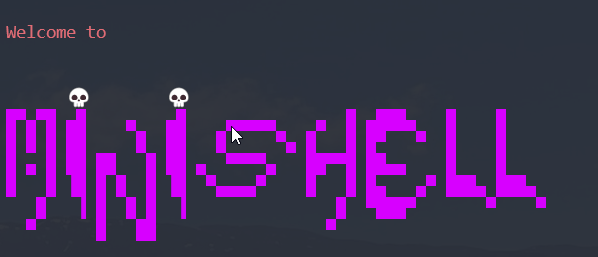
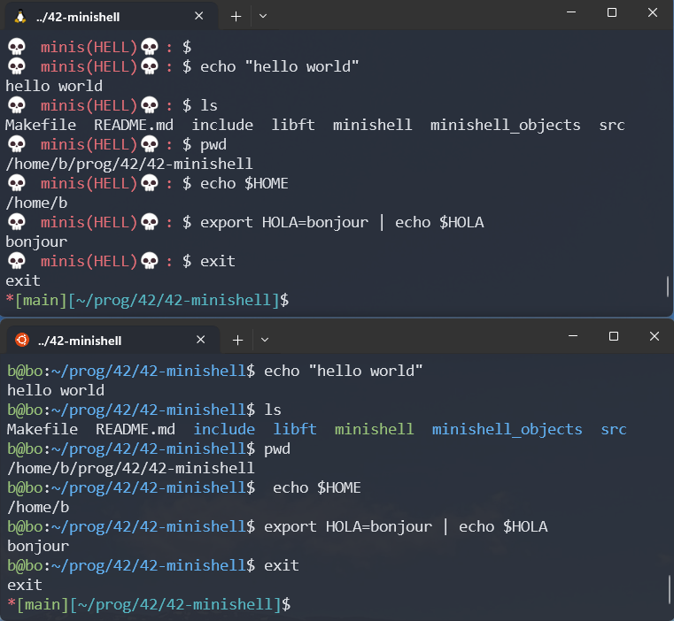
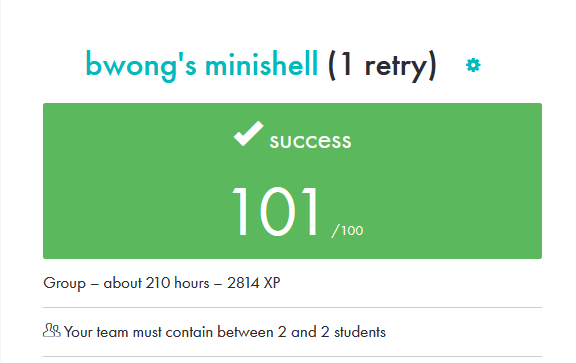

# 42-minishell

This project involves developing a simple shell - a miniature version of bash. The endeavor offers valuable insights into processes and file descriptors, providing a hands-on learning experience in these fundamental computing concepts.

## Requirements:

• This project must be created in group of 2 people - groupmate:
• Display a prompt when waiting for a new command \
• Implement pipes (| character). The output of each command in the pipeline is connected to the input of the next command via a pipe. \
• Handle environment variables ($ followed by a sequence of characters) which
should expand to their values \
• Handle $? which should expand to the exit status of the most recently executed
foreground pipeline \
• Handle ctrl-C, ctrl-D and ctrl-\ which should behave like in bash \
• Your shell must implement the following builtins:\
    ◦ echo with option -n \
    ◦ cd with only a relative or absolute path \
    ◦ pwd with no options \
    ◦ export with no options \
    ◦ unset with no options \
    ◦ env with no options or arguments \
    ◦ exit with no options \

## Preview

## Finall Marks

> [!WARNING]
> Do not copy without understanding the code
